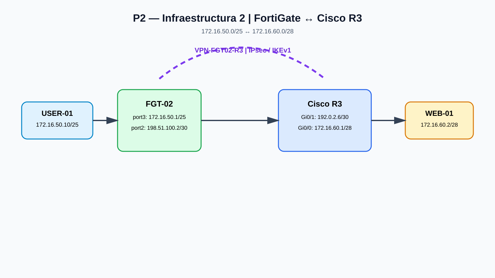

# P2 — Infraestructura 2
## VPN IPsec FortiGate ↔ Cisco R3

**Asignatura:** Seguridad de Redes  
**Proyecto:** P2-Seguridad-Redes-VPN-FortiGate-2025-1331  
**Infraestructura:** 2 de 3  
**Autor:** Elian Sterling  
**Fecha:** octubre de 2026

### 🎥 Video de demostración

**[Ver demostración de Infraestructura 2](https://youtu.be/zmOdv6nX4SU)**

### Objetivo

Implementar y validar un túnel IPsec entre **FGT-02** y **Cisco R3**, permitiendo que la red de usuarios `172.16.50.0/25` alcance la red de servidores `172.16.60.0/28`.

### Arquitectura

### Direccionamiento principal

| Equipo / interfaz | Dirección | Función |
|---|---|---|
| USER-01 | 172.16.50.10/25 | Cliente |
| FGT-02 port3 | 172.16.50.1/25 | LAN de usuarios |
| FGT-02 port2 | 198.51.100.2/30 | WAN |
| Cisco R3 Gi0/1 | 192.0.2.6/30 | WAN |
| Cisco R3 Gi0/0 | 172.16.60.1/28 | LAN de servidores |
| WEB-01 | 172.16.60.2/28 | Servidor |

### VPN IPsec

- IKEv1.
- PSK.
- Phase 1: DES/SHA-1, DH14.
- Phase 2: DES/SHA-1, PFS/DH14.
- Selectores: **172.16.50.0/25 ↔ 172.16.60.0/28**.
- Crypto map de Cisco aplicado a `GigabitEthernet0/1`.

### Resultado documentado

La negociación IKE llegó a estado operativo y posteriormente se creó el IPsec SA con los selectores correctos. La prueba ICMP entre USER-01 y WEB-01 fue validada con **4/4 respuestas y 0 % de pérdida**.

**Nota:** la prueba final específica de SSH a `172.16.60.2:22` no se continuó y no se presenta como servicio validado.

### Contenido

- **[Documentación técnica](docs/infraestructura.md)**
- **[Comandos](docs/comandos.md)**
- **[Evidencias](docs/evidencias.md)**
- **[Configuración sanitizada FGT-02](configs/FGT-02-phase1-phase2-sanitized.txt)**
- **[Verificación Cisco R3](configs/R3-crypto-verification.txt)**
- **[Diagrama](diagrams/topologia-infraestructura-2.svg)**
- **[Capturas](evidencias/)**

### Seguridad

Las PSK y cualquier otro secreto se omiten deliberadamente y se sustituyen por `<REDACTED>`.
